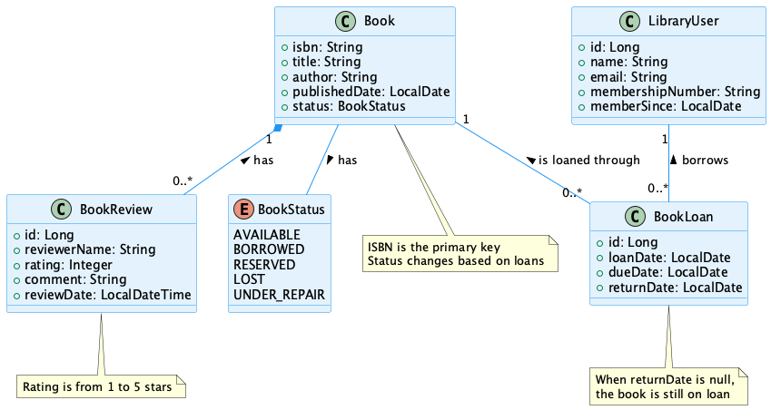
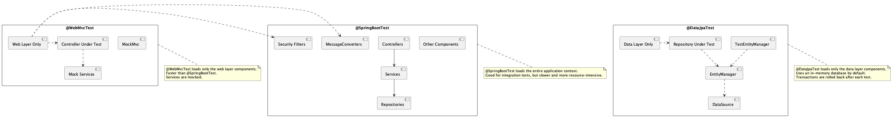
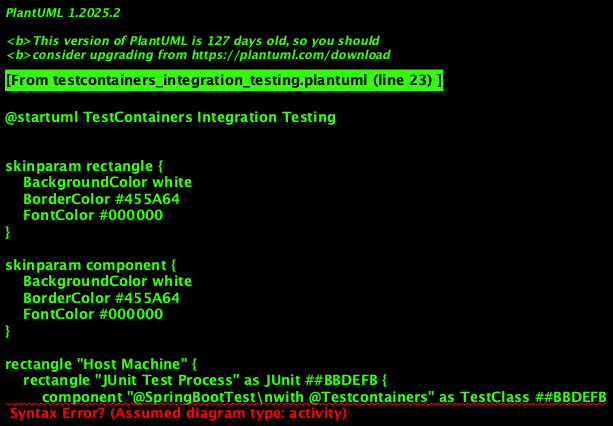
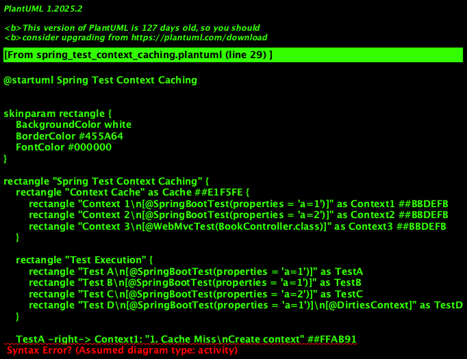
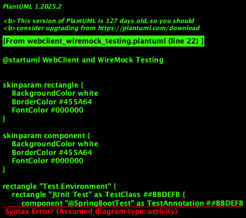

# Testing Spring Boot Applications Demystified Workshop

[](https://codespaces.new/PragmaTech-GmbH/testing-spring-boot-applications-demystified-workshop)

A one-day workshop to help developers become more confident and productive when implementing automated tests for Spring Boot applications.

## Workshop Overview

This workshop is designed to demystify testing in Spring Boot applications through hands-on exercises, covering everything from basic unit testing to advanced integration testing techniques. The workshop is divided into four lab sessions, each focusing on different aspects of testing Spring Boot applications.

## Workshop Format

- One-day workshop (approximately 6-7 hours of instruction)
- Four main slots, ranging from 70-110 minutes each
- Hands-on exercises with provided solutions
- Building on a consistent domain model (a library management system)

## GitHub Codespaces

This repository is configured for use with GitHub Codespaces, which provides a complete, ready-to-use development environment in the cloud. To use GitHub Codespaces:

1. Click on the "Code" button on the GitHub repository
2. Select the "Codespaces" tab
3. Click "Create codespace on main"
4. Wait for the codespace to start and setup to complete

The codespace includes:
- Java 21
- Maven
- Docker (for TestContainers)
- VS Code with Spring Boot extensions
- All diagrams rendered as images

For more information, see the [Codespaces documentation](.devcontainer/README.md).

## Todos:

- [ ] ZIP Version to share for non-git Users
- [ ] Workshop infos, links for attendees on my company website

## Workshop Slots

9 AM - 10:45: Slot 1 105 minutes
10:45 - 11:05: Coffee Break
11:05 - 13:00: Slot 2 115 minutes
13:00 - 14:00 Lunch
14:00 - 15:30: Slot 3 90 minutes
15:30 - 15:50 Coffee Break
15:50 - 17:00: Slot 4 70 minutes

### Slot 1 (105 Minutes): Introduction, Welcome, Code Setup, Spring Boot Testing Fundamentals

- Introduction to the workshop, show goals for the day
- Timeline, breaks, questions, code, and exercises
- Formal start with introduction of myself, then all the participants -> write down names like teacher

- Why do we Test Code?
- Why is testing an afterthought?
- How to make testing more joyful?

- My Journey to testing

- Workshop code examples: GitHub repository, Java 21 and Docker

- Maven Testing Basics
- Gradle Testing Basics
- Java Testing Basics: AAA Pattern, naming methods, other best practices

- Spring Boot Testing basics
  - Exploring the Testing Toolbox
  - JUnit: 4 vs. 5.: most important annotations, features, understanding when JUnit will instantiate a test class
  - More details on AssertJ
  - Mockito: default stubbing, how to create a mock?, DO's and DON'Ts (golden mockito rules)

- Unit testing with Spring
  - External collaborators and dependency injection for testability
  - Sample test to showcase
  - How to handle static? -> Date.now() example

Exercises: 
- JUnit: Creating custom JUnit 5 extensions, explore parameterized tests
- Mockito: Explore stubbing, see default mock behavior
- AssertJ: Explore the fluent API, chaining assertions, expecting exceptions

### Slot 2 (115 Minutes): Testing Spring MVC and Data JPA with Test Slices

- Discuss Exercise from Slot 1

- Introduction to sliced testing
- When unit testing is not sufficient
- Using @WebMvcTest for controller testing
- Comparing Sliced Testing to plain Unit Testing -> pros and cons

- Testing filters and security configurations
- Using @DataJpaTest for repository testing
  - In-memory vs. real database
  - How to prepare data
  - Transaction management
- Understanding JPA's transaction behavior and EntityManager
- Testing custom database queries, including native SQL queries

Exercise:
- @WebMvcTest: Testing a controller with MockMvc
- @DataJpaTest: Testing a repository with a custom SQL query, verify the JPA entity can be stored, retrieved -> pitfall with flushing/commit persistence context
- Explore sliced tests for your own tech-stack

- Discuss Exercise solutions for Slot 2

### Slot 3 (90 Minutes): Integration Testing with Testcontainers and WireMock

- Full application testing with @SpringBootTest
- Testing with WebClient and WebTestClient
- Mocking external services with WireMock
- Introduction to Testcontainers for external resources
- Data cleanup strategies for integration tests
- Understanding Spring test context caching
- Performance optimization in test suites
- Testing from outside with TestRestTemplate

Exercise:
- Seeing MockMvc vs. TestRestTemplate in action
- Setup Testcontainers and WireMock as Docker containers
- Improve test for context caching

### Slot 4 (70 Minutes): Advanced Testing Techniques and Best Practices

- Discuss Exercise from Slot 3
- Common Spring Boot testing pitfalls and how to avoid them
  - 1. ABC
  - 2. @SpringBootTest Obsession
  - 3. JUnit 4 vs. 5 pitfall
- Best practices for testing Spring Boot applications
  - 1. Parallelizing tests
  - 2. Get help from AI
  - 3. Mutation testing -> show in action

- Final thoughts
- Pitch follow-up courses/workshops
- Q&A round
- Try to gather feedback, make the connect on LinkedIn 
- Certificates for the participants, reach out via LinkedIn or mail

## Domain Model

The workshop uses a library management system as the sample domain. The domain model consists of books, library users, loans, and reviews.



## Lab Structure

Each lab (`lab-1` through `lab-4`) includes:

- Exercise files with instructions and TODO comments
- Solution files that show the complete implementation
- Supporting code and configurations

## Prerequisites

- Java 21 (or later)
- Maven 3.8+ (wrapper included)
- Docker (for Testcontainers in Lab 3)
- Your favorite IDE (IntelliJ IDEA, Eclipse, VS Code)

## Getting Started

1. Clone this repository:
   ```bash
   git clone https://github.com/yourusername/testing-spring-boot-applications-demystified.git
   ```

2. Import the projects into your IDE of choice.

3. Navigate to each lab directory and run:
   ```bash
   ./mvnw clean verify
   ```

## Lab 1: Spring Boot Testing Fundamentals

In this lab, you'll learn the basics of testing Spring Boot applications:

- Set up JUnit 5 tests for domain model classes
- Use Mockito to mock dependencies and test service classes
- Refactor time-dependent code to improve testability
- Create custom JUnit 5 extensions

Key files:
- [`Exercise1_BasicUnitTesting.java`](labs/lab-1/src/test/java/pragmatech/digital/workshops/lab1/exercises/Exercise1_BasicUnitTesting.java)
- [`Exercise2_MockitoBasics.java`](labs/lab-1/src/test/java/pragmatech/digital/workshops/lab1/exercises/Exercise2_MockitoBasics.java)
- [`Exercise3_RefactorTimeDependent.java`](labs/lab-1/src/test/java/pragmatech/digital/workshops/lab1/exercises/Exercise3_RefactorTimeDependent.java)
- [`Exercise4_JUnit5Extensions.java`](labs/lab-1/src/test/java/pragmatech/digital/workshops/lab1/exercises/Exercise4_JUnit5Extensions.java)

## Lab 2: Testing Spring MVC and Data JPA with Test Slices

In this lab, you'll learn how to use Spring Boot's test slices:



- Test Spring MVC controllers with @WebMvcTest
- Test security configurations
- Test repository classes with @DataJpaTest
- Understand JPA's transaction behavior

Key files:
- [`Exercise1_WebMvcTest.java`](labs/lab-2/src/test/java/pragmatech/digital/workshops/lab2/exercises/Exercise1_WebMvcTest.java)
- [`Exercise2_FilterSecurityTest.java`](labs/lab-2/src/test/java/pragmatech/digital/workshops/lab2/exercises/Exercise2_FilterSecurityTest.java)
- [`Exercise3_DataJpaTest.java`](labs/lab-2/src/test/java/pragmatech/digital/workshops/lab2/exercises/Exercise3_DataJpaTest.java)

## Lab 3: Integration Testing with TestContainers

In this lab, you'll learn how to use Testcontainers for integration testing:



You'll also learn about Spring test context caching:



- Set up full application tests with @SpringBootTest
- Configure and use Testcontainers for PostgreSQL
- Understand Spring test context caching and performance
- Test your application from the outside with TestRestTemplate

Key files:
- [`Exercise1_SpringBootTest.java`](labs/lab-3/src/test/java/pragmatech/digital/workshops/lab3/exercises/Exercise1_SpringBootTest.java)
- [`Exercise2_TestContextCaching.java`](labs/lab-3/src/test/java/pragmatech/digital/workshops/lab3/exercises/Exercise2_TestContextCaching.java)
- [`Exercise3_TestContainers.java`](labs/lab-3/src/test/java/pragmatech/digital/workshops/lab3/exercises/Exercise3_TestContainers.java)

## Lab 4: Advanced Testing Techniques and Best Practices

In this lab, you'll learn advanced testing techniques and best practices:



- Test reactive applications with WebTestClient
- Mock external services with WireMock
- Avoid common Spring Boot testing pitfalls
- Apply best practices for test organization and maintainability

Key files:
- [`Exercise1_WebClientTesting.java`](labs/lab-4/src/test/java/pragmatech/digital/workshops/lab4/exercises/Exercise1_WebClientTesting.java)
- [`Exercise2_CommonPitfalls.java`](labs/lab-4/src/test/java/pragmatech/digital/workshops/lab4/exercises/Exercise2_CommonPitfalls.java)
- [`Exercise3_BestPractices.java`](labs/lab-4/src/test/java/pragmatech/digital/workshops/lab4/exercises/Exercise3_BestPractices.java)

## Resources

- [Official Spring Boot Testing Documentation](https://docs.spring.io/spring-boot/docs/current/reference/html/features.html#features.testing)
- [JUnit 5 User Guide](https://junit.org/junit5/docs/current/user-guide/)
- [Mockito Documentation](https://javadoc.io/doc/org.mockito/mockito-core/latest/org/mockito/Mockito.html)
- [Testcontainers Documentation](https://www.testcontainers.org/)
- [WireMock Documentation](http://wiremock.org/docs/)

## License

This project is licensed under the MIT License - see the LICENSE file for details.

## Longer Workshop


Module I: Introduction & Spring Boot Testing 101

Timing: 09:00 - 10:00

Goal: Get to know everyone and share a common goal why testing is important.

- Introduction of myself
- Let all the participants introduce themselves:
  - What’s your name and role in the team?
  - Including their current experience with testing Spring Boot applications
  - Their expectation to the workshop?
- Overview of what we’re about to cover in this workshop, show the agenda including the breaks
- General stuff:
  - Making sure everyone has access to the repository
  - How to ask questions?
- Start with Motivation for testing
- Why should we be testing our code?
  - Fearless refactoring when having a covering test suite
  - Tests act as documentation about the code, new joiners can inspect the tests method names to better understand the domain and implementation
  - More confidence in making changes to existing code, ensuring we don’t introduce a regression
  - Adding new features becomes safer
  - We have a automated safety net and don’t need manual interference
  - Manual testing is potentially error-prone and takes time
  - We can achieve true Continuous Deployment as we can deploy to production once our tests pass
  - Test coverage? Vanity metric, barely seen teams doing it right
- Why is testing an afterthought?
  - Makes less fun compared to writing production code
  - Lacking content and knowledge about it, a lot of conference talks only focus on shiny new features
  - We all need to do it but rarely talk about it
  - Tight deadlines & project pressure makes us deprioritise our testing efforts.
- How should we test?
  - Testing pyramid? Testing Honeycomb? Testing trophy?
  - Implicit confidence in making changes, what and how we test is more important
  - Different applications require different test strategies:
    - Logarithmic library: more unit tests
    - Restful micro service with interaction to other micro service: a good set of integration tests
    - Self-contained application: all of the above plus some end-to-end tests
- Testing naming conventions?
  -  I try to stick to a simplified setup, what’s the benefit of being more granular
  - Endless discussions what a unit and an integration test is
  - Separating them to parallelize unit, integration and end-to-end tests
  - Unit tests: Verify the functionality of a specific section of code, usually a single function or method, in isolation from other parts of the system - Characteristics: Fast, self-contained, test a single thing in isolation, no side effects
  - Integration tests: Verify that different units or modules of the application work together as expected - Characteristics: They may interact with external systems like databases, APIs, or message queues
  - End-to-End tests. Verify that the entire application works together as a whole, simulating real user scenarios - Characteristics: Often executed in an environment that closely resembles production, slowest type of tests, may run nightly, tests cover the entire application stack
- TDD?
  - Test-Driven development, the test comes first and drives the implementation
  - Hard for me to grasp in the beginning as I was lacking testing skills and tried to fix everything with my hammer, “If all you have is a hammer, everything looks like a nail”
  - You need to extend your knowledge about the Java testing toolbox
  - It takes some time to get used to it and discipline to stick to it, we’re programmed in our brains to jump right into the implementation
  - Need to see the problem from a different perspective and start with the question: “How do I verify what I’m about to implement”?
  - Great extreme programming technique when done as a pair: One person writes the test and the other person the implementation

Coffee break: 10:00 - 10:15

Timing: 10:15 - 12:00

Goal: Getting to know the fundamentals that Spring Boot provides for testing

- Testing with the Spring Boot Starter Test aka. The Testing Swiss-Army Knife
- Explain the Maven defaults for testing: Surefire and Failsafe plugin
  - Naming conventions for tests
  - Maven build phases
  - Importance of Failsafe plugin to also execute the verify goal
- Introspect all basic testing libraries that Spring Boot provides
  - JUnit:
    - Must knows about JUnit: Understand how JUnit 5 is build together, complete rewrite of JUnit 4 in 2017, TestEngine and tooling around
    - APIs to show: test structure, lifecycle methods, assertions, advanced Extension API and lifecycle methods (show example), programatic access to our test execution
    - Test order: Deterministic but not guessable, test should not rely on any order
    - Test conventions for the name and variables
  - Mockito:
    - Why do we need Mockito? Showcase a simple example for unit testing. Without it, we would need to instantiate the real collaborator and test multiple things in parallel
    - Show how to mock classes, stub method class, favour public constructor
    - Mockito extension
    - Must know about Mockito: Stubbing, default return values, mocking final classes and static methods
    - Avoid mocking hell where you copy the implementation 1:1, rather split the class, indicator that a method is doing more than one thing
    - Golden Mockito rules:
      * Do not mock types you don't own (Important on the boundary to a framework or library, that class can change its behaviour, use the real one or lookup for framework provided classes for testing purposes)
      * Don't mock value objects
      * Don't mock everything
      * Show some love with your tests.
  - AssertJ: Assertion Library
  - Hamcrest: Assertion Library
  - Awaitility: Recently added to test and verify asynchronous code
  - XMLUnit
  - Assertion library rule: stick to one, at least within on test, better within the project, pragmatic choice
- Scope the test dependencies as `test` so they don’t end up in the prod jar
- Show dependency management with Spring Boot, where to lookup the dependency version on the web

Exercise:

1. Up- and downgrade the version of Mockito without excluding and including it on your own, see the impact on the project with ./mvnw dependency-tree
2. Write assertions for the sample test with all three variations
3. Write a JUnit extension to print out the current time before each test

Lunch  12:00 - 13:00

Module II: Sliced Context Testing

Goal: Understand the usage of sliced context testing and how it’s different from plain unit testing with JUnit and Mockito.

13:00 - 14:30

- Lay out tools for plain unit testing with Mockito and JUnit
- Show cases where it’s not sufficient (e.g. web layer) for plain unit tests
  - Weblayer for status codes, JSON parsing
- Two types of test with Spring: with a test context (within here also two differences: a partial application context and the entire context) and without
- Solutions on how to fix missing beans: @MockBean, @Primary, @Bean
- Introduce sliced tests, explain the sliced Spring context
- Start with @WebMvcTest for a single controller
  - Specify a single controller or none to bootstrap all
  - Show all beans that gets populated
  - Explain MockMvc and the difference compared to a locally running servlet container
  - Explain how to interact with it using MockMvc
  - Interact with MockMvc with WebTestClient
  - Show which classes are included and which not
- Include Spring Security to the test setup and go through the many options we have to set the user
  - In previous Spring Boot versions, Spring Security was automatically configured, now it needs to be added
  - Verify your authentication and authorization, try not to test Spring Security
  - Setting the authenticated user with:
    - Annotation
    - Within the request and a fluent method of MockMvc
    - SecurityContextHolder
- Explain property file hierarchy with Spring, where Spring Test takes its values to resolve

Exercise & Solution discussion:

1. Write a MockMvc test to create a entity and ensure the location header is set and the call returns 201

Coffee break 14:30 - 14:45

Module III: Testing the Persistence Layer

14:45 - 16:00

- Start with Motivation, why a plain unit test is not sufficient for tests with the database layer
- Show the simple domain model
- Discuss in-memory databases for tests:
  - Why H2 is not sufficient enough for testing
  - Better to use the same database as in production, but how?
- Introducing Testcontainers
  - Remove docker image to show that it gets pulled
  - Include it into the project, no version needed
  - Step-by-step explanation of TC
  - Explore modules https://testcontainers.com/modules/
  - Wrapper API on top of the Docker Java API to manage the lifecycle of Docker containers for testing purposes
  - Works with anything your can containerise
  - Show the start and stopping of containers
  - TestcontainersExtension for the lifecycle
  - Seamless transition between developers machines, not additional setup required
  - Connecting to a local running database, show multiple ways @ServiceConnection, system properties, etc.
  - Lifecycle management of Testcontainers container with Extension and without
- Configuring everything
- Explain pitfalls of the first level cache
- Maven things related to tests
- Populate data with @Sql
- Strategies for larger projects:
  - Prepare a nightly pre-populated database image
  - Reuse existing containers
- Cleanup afterwards
- Transactions management within tests

Exercise & solution discussion:

1. Testing native queries

- Tages wrapping up of the day
- Feedback

Day Two

Module IV: Testing with @SpringBootTest

Start: 09:00 - 10:00

- Recap of the previous day
- Lay out the agenda for today
- Q&A for day one

Coffee break 10:00 - 10:15

10:15 - 12:00

- Further relevant Spring Boot test slices: HTTP client -> WireMock
- Creating your own Spring Boot test slice, example of @SqsTest
- Writing tests with the entire Spring Boot application context
  - Prepare beans
  - Provide infrastructure components
  - Stub initial HTTP calls
- Try to stick to happy paths
- How to reach to the application
- Spring TestContext context caching
- Transaction pitfalls

Exercise & solution discussion:

1. Use the WebTestClient to perform a test

Lunch: 12:00 - 13:00

Module V: End-to-End Tests?

13:00 - 14:30

- Interaction with the browser/UI
- Selenium
- Selenide: BrowserManager + Wrapper API
- Run headless & headful
- PageObject pattern
- Dockerize the webdriver

Coffee break: 14:30 - 14:45

Module VI: Pitfalls, Best Practices, Tips

14:45 - 16:00

- Use @SpringBootTest everywhere
- Mix JUnit 4 and 5
- Try to streamline the test setup avoid too much inheritance, composition
- Keep your tests fast and reproducible:
  - Focus on flaky tests
  - Use containers for infrastructure
  - Parallelise your tests, making them independent
- Automate code migrations with OpenRewrite
  - Migrate from
- Reusing Containers, Testcontainers Cloud
- Gen AI and testing, examples with GitHub Copilot (proxy for ChatGPT) and Diffblue
- Wrapping up the day & final Q&A
