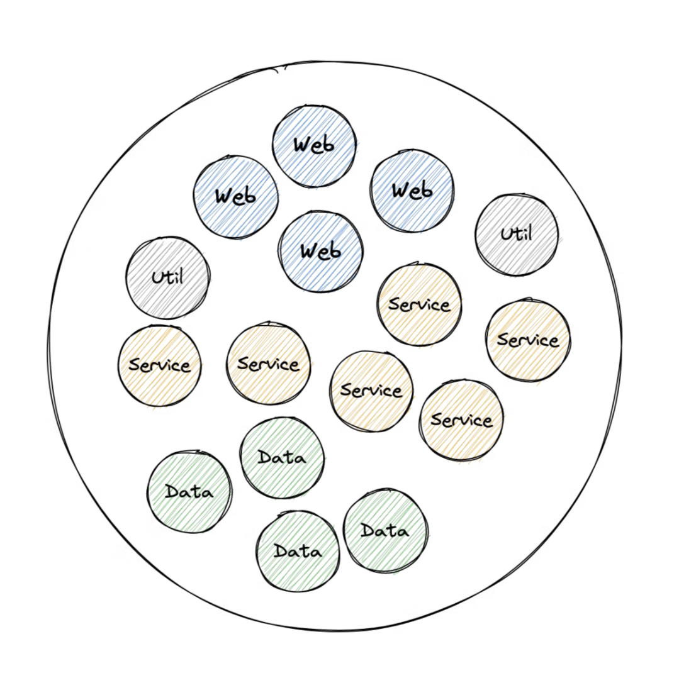
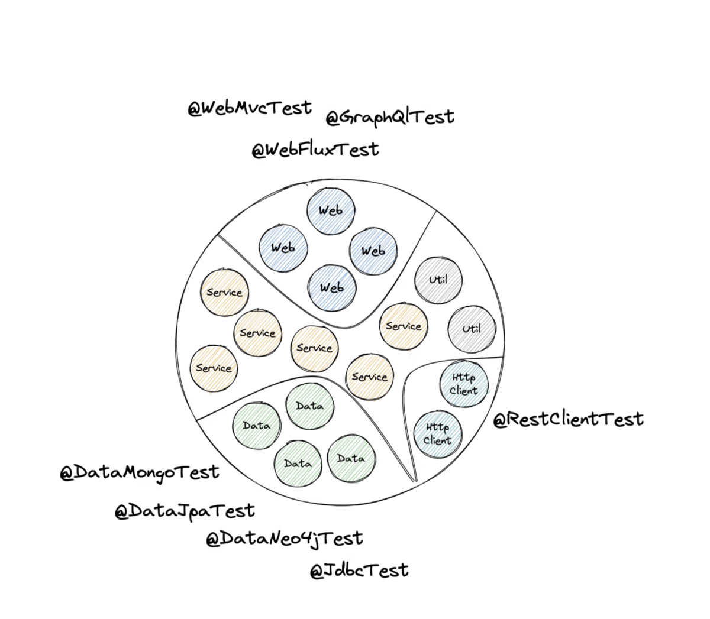
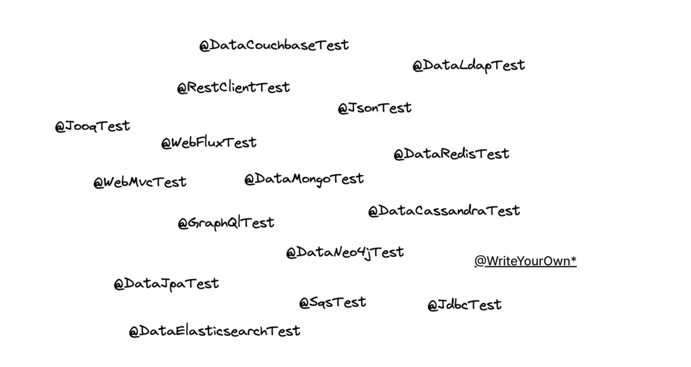
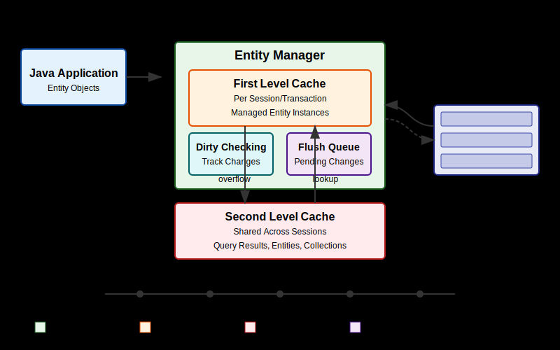

<style>
img[alt~="center"] {
  display: block;
  margin: 0 auto;
}
</style>


---

<!-- _class: title -->


# Testing Spring Boot Applications Demystified

## Full-Day Workshop

_Spring I/O Conference Workshop 21.05.2025_

Philip Riecks - [PragmaTech GmbH](https://pragmatech.digital/) - [@rieckpil](https://x.com/rieckpil)


--- 

<!-- header: 'Testing Spring Boot Applications Demystified Workshop @ Spring I/O 21.05.2025' -->
<!-- footer: '' -->


# Lab 2

## Sliced Testing

---

## Discuss Exercises from Lab 1

---

## Unit Testing Has Limits

- **Request Mapping**: Does `/api/users/{id}` actually resolve to your desired method?
- **Validation**: Will incomplete request bodys result in a 400 bad request or return an accidental 200?
- **Serialization**: Are your JSON objects serialized and deserialized correctly?
- **Headers**: Are you setting Content-Type or custom headers correctly?
- **Security**: Are your Spring Security configuration and other authorization checks enforced?
- **Database**: Can we effectively map our complex JPA entity to a database table?
- etc.

---

## Unit Testing a Controller

```java
@ExtendWith(MockitoExtension.class)
class BookControllerUnitTest {

  @Mock
  private BookService bookService;

  @InjectMocks
  private BookController bookController;

  // ...
}
```

---

<!-- _class: section -->

# A Better Alternative
## Sliced Testing


---

## A Typical Spring Application Context



---



---

## Slicing Example: @WebMvcTest

- Testing your web layer in isolation and only load the beans you need
- `MockMvc`: Mocked servlet environment with HTTP semantics

```java
@WebMvcTest(BookController.class)
@Import(SecurityConfig.class)
class BookControllerTest {

  @Autowired
  private MockMvc mockMvc;

  @MockitoBean
  private BookService bookService;

}
```

- See `WebMvcTypeExcludeFilter` for included Spring beans

---



---

## Common Test Slices

- `@WebMvcTest` - Controller layer
- `@DataJpaTest` - Repository layer
- `@JsonTest` - JSON serialization/deserialization
- `@RestClientTest` - RestTemplate testing
- `@WebFluxTest` - WebFlux controller testing
- `@JdbcTest` - JDBC testing

---

## Introducing: @DataJpaTest

```java
@DataJpaTest
class BookRepositoryTest {
  
    @Autowired
    private TestEntityManager entityManager;
    
    @Autowired
    private BookRepository bookRepository;
}
```

- Tests JPA repositories
- Auto-configures in-memory database
- Provides `TestEntityManager`
- Verify JPA entity mapping, creation and native queries

---

## In-Memory vs. Real Database

- By default, Spring Boot tries to autoconfigure an in-memory relational database (H2 or Derby)
- In-memory database pros:
  - Easy to use & fast
  - Less overhead
- In-memory database cons:
  - Mismatch with the infrastructure setup in production
  - Despite having compatibility modes, we can't fully test proprietary database features

---

<!--

Notes:

- who is not using Testcontainers
- explain basics

-->

## Solution: Docker & Testcontainers


---

## Using a Real Database

```java
@Container
@ServiceConnection
static PostgreSQLContainer<?> postgres = new PostgreSQLContainer<>("postgres:16-alpine")
  .withDatabaseName("testdb")
  .withUsername("test")
  .withPassword("test")
  .withInitScript("init-postgres.sql"); // Initialize PostgreSQL with required extensions
```

---



---

## Test Data Management

- Each test should start with a known state
- Tests should not interfere with each other
- Options:
  - Truncate tables between tests
  - Transaction rollback (`@Transactional`)
  - Separate schemas per test
  - Database resets

---

## Testing Native Queries

```java
/**
 * PostgreSQL-specific: Full text search on book titles with ranking.
 * Uses PostgreSQL's to_tsvector and to_tsquery for sophisticated text searching
 * with ranking based on relevance.
 *
 * @param searchTerms the search terms (e.g. "adventure dragons fantasy")
 * @return list of books matching the search terms, ordered by relevance
 */
@Query(value = """
  SELECT * FROM books
  WHERE to_tsvector('english', title) @@ plainto_tsquery('english', :searchTerms)
  ORDER BY ts_rank(to_tsvector('english', title), plainto_tsquery('english', :searchTerms)) DESC
  """,
  nativeQuery = true)
List<Book> searchBooksByTitleWithRanking(@Param("searchTerms") String searchTerms);
```

---

# Time For Some Exercises
## Lab 2

- Work with the same repository as in lab 1
- Navigate to the `labs/lab-2` folder in the repository and complete the tasks as described in the `README` file of that folder
- Time boxed until the end of the lunch break (14:00 AM)
