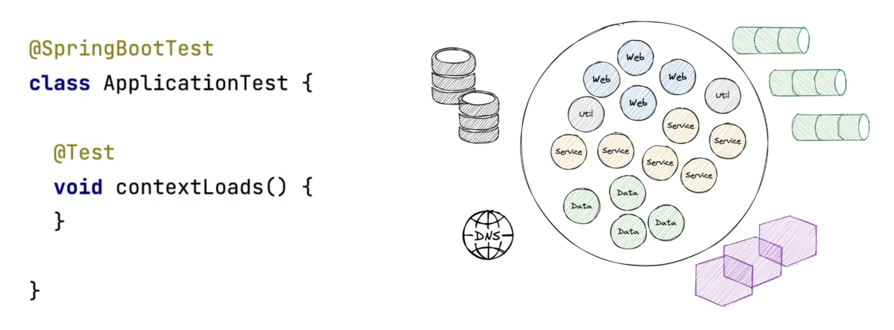
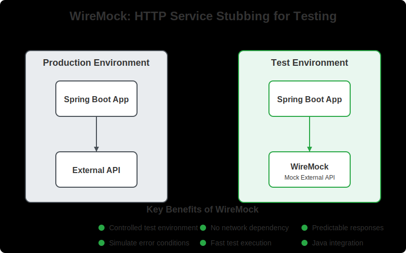

---

<style>
img[alt~="center"] {
  display: block;
  margin: 0 auto;
}
</style>

<!-- _class: title -->


# Testing Spring Boot Applications Demystified

## Full-Day Workshop

_Spring I/O Conference Workshop 21.05.2025_

Philip Riecks - [PragmaTech GmbH](https://pragmatech.digital/) - [@rieckpil](https://x.com/rieckpil)

--- 


# Lab 3

## Integration Testing

---

## Discuss Exercises from Lab 2

---
<!-- _class: section -->

# Starting Everything
## Writing Tests Against a Complete Application Context


---

<!--

Notes:

-->

## The Default Integration Test



---

## Starting the Entire Context

- Provide external infrastructure with [Testcontainers](https://testcontainers.com/)
- Start Tomcat with: `@SpringBootTest(webEnvironment = WebEnvironment.RANDOM_PORT)`
- Consider WireMock/MockServer for stubbing external HTTP services
- Test controller endpoints via: `MockMvc`, `WebTestClient`, `TestRestTemplate`

---

## Introducing: Microservice HTTP Communication

```java
public BookMetadataResponse getBookByIsbn(String isbn) {
  return webClient.get()
    .uri("/isbn/{isbn}", isbn)
    .retrieve()
    .bodyToMono(BookMetadataResponse.class)
    .block();
}
```

---

## HTTP Communication During Tests

- Unreliable when performing real HTTP responses during tests
- Sample data? 
- Authentication?
- Cleanup?
- No airplane-mode testing possible anymore
- Solution: Stub the HTTP responses for remote system

---



---

## Introducing WireMock

- In-memory (or container) Jetty to stub HTTP responses
- Simulate failures, slow responses, etc.
- Stateful setups possible (scenarios): first request fails, then succeeds
- Alternatives: MockServer, MockWebServer, etc.

```java
wireMockServer.stubFor(
  get("/isbn/" + isbn)
    .willReturn(aResponse()
      .withHeader(HttpHeaders.CONTENT_TYPE, MediaType.APPLICATION_JSON_VALUE)
      .withBodyFile(isbn + "-success.json"))
);
```

---

## Making Our Application Context Start

- Stubbing HTTP responses during the launch of our Spring Context
- Introducing a new concept: `ContextInitializer`

```java
WireMockServer wireMockServer = new WireMockServer(WireMockConfiguration.wireMockConfig().dynamicPort());

wireMockServer.start();

// Register a shutdown hook to stop WireMock when the context is closed
applicationContext.addApplicationListener(event -> {
  if (event instanceof ContextClosedEvent) {
    logger.info("Stopping WireMock server");
    wireMockServer.stop();
  }
});

TestPropertyValues.of(
  "book.metadata.api.url=http://localhost:" + wireMockServer.port()
).applyTo(applicationContext);
```

---
<!--

- Go to `DefaultContextCache` to show the cache

-->

## Spring Test `TestContext` Caching

- Part of Spring Test (automatically part of every Spring Boot project via `spring-boot-starter-test`)
- Spring Test caches an already started Spring `ApplicationContext` for later reuse
- Cache retrieval is usually faster than a cold context start
- Configurable cache size (default is 32) with LRU (least recently used) strategy

Speed up your build:


---

## Caching is King


---

## How the Cache Key is Built

This goes into the cache key (`MergedContextConfiguration`):

- activeProfiles (`@ActiveProfiles`)
- contextInitializersClasses (`@ContextConfiguration`)
- propertySourceLocations (`@TestPropertySource`)
- propertySourceProperties (`@TestPropertySource`)
- contextCustomizer (`@MockitoBean`, `@MockBean`, `@DynamicPropertySource`, ...)

---
## Identify Context Restarts


---

## Investigate the Logs


---

## Spot the Issues for Context Caching


---

## Context Caching Issues

Common problems that break caching:

1. Different context configurations
2. @DirtiesContext usage
3. Modifying beans in tests
4. Different property settings
5. Different active profiles

---

## Make the Most of the Caching Feature


- Avoid `@DirtiesContext` when possible, especially at `AbstractIntegrationTest` classes
- Understand how the cache key is built
- Monitor and investigate the context restarts
- Align the number of unique context configurations for your test suite

---

# External Dependencies in Tests

- Need real databases, message brokers, services
- Cannot use in-memory alternatives for everything
- Must be repeatable and isolated
- Should be fast and reliable

Enter: **Testcontainers**

---

# Time For Some Exercises
## Lab 3

- Work with the same repository as in lab 1/lab 2
- Navigate to the `labs/lab-3` folder in the repository and complete the tasks as described in the `README` file of that folder
- Time boxed until the end of the coffee break (15:50 AM)
