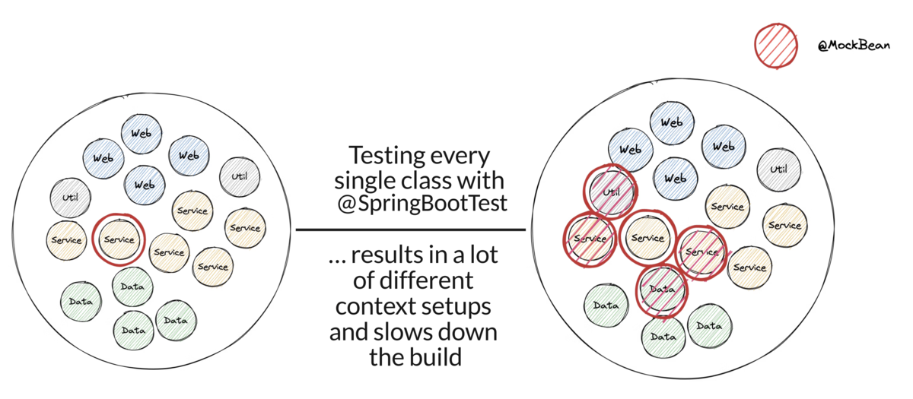

---

<!-- _class: title -->

# Testing Spring Boot Applications Demystified

## Full-Day Workshop

_Spring I/O Conference Workshop 21.05.2025_

Philip Riecks - [PragmaTech GmbH](https://pragmatech.digital/) - [@rieckpil](https://x.com/rieckpil)

--- 

<!-- header: 'Testing Spring Boot Applications Demystified Workshop @ Spring I/O 21.05.2025' -->
<!-- footer: '' -->

# Lab 4

## Best Practices, Pitfalls, AI & Outlook

---

## Discuss Exercises from Lab 3

---

# Last Lab
## Spring Boot Testing Best Practices & Pitfalls

---

### Best Practice 1: Test Parallelization

**Goal**: Reduce build time and get faster feedback

Requirements:
- No shared state
- No dependency between tests and their execution order
- No mutation of global state

Two ways to achieve this:
- Fork a new JVM with Surefire/Failsafe and let it run in parallel -> more resources but isolated execution
- Use JUnit Jupiter's parallelization mode and let it run in the same JVM with multiple threads

---

---

<!--

Notes:
- Useful to get started
- Boilerplate and skeleton help
- LLM very usueful for boilerplate setup, test data, test migration (e.g. Kotlin -> Java)
- ChatBots might not produce compilable/working test code, agents are better
-->

### Best Practice 2: Get Help from AI

- [Diffblue Cover](https://www.diffblue.com/): #1 AI Agent for unit testing complex Java code at scale
- Agent vs. Assistant
- LLMs: ChatGPT, Claude, Gemini, etc.
- Claude Code
- TDD with an LLM?
- (Not AI but still useful) OpenRewrite for migrations
- Clearly define your requirements in e.g. `claude.md` or cursor rule files

---

### Best Practice 3: Try Mutation Testing

- Having high code coverage might give you a **false sense of security**
- Mutation Testing with [PIT](https://pitest.org/quickstart/)
- Beyond Line Coverage: Traditional tools like JaCoCo show which code runs during tests, but PIT verifies if your tests actually detect when code behaves incorrectly by introducing "**mutations**" to your source code.
- Quality Guarantee: PIT automatically modifies your code (changing conditionals, return values, etc.) to ensure your tests fail when they should, **revealing blind spots** in seemingly comprehensive test suites.
- Considerations for bigger projects: only run on the new code diffs, not on the whole codebase

---

---

# Common Spring Boot Testing Pitfalls to Avoid

---

## Testing Pitfall 1: `@SpringBootTest` Obsession

- The name could apply it's a one size fits all solution, but it isn't
- It comes with costs: starting the (entire) application context
- Useful for integration tests that verify the whole application but not for testing a single service in isolation
- Start with unit tests, see if sliced tests are applicable and only then use `@SpringBootTest`

---

## @SpringBootTest Obsession Visualized

---

## Testing Pitfall 2: @MockitoBean vs. @MockBean vs. @Mock

- `@MockBean` is a Spring Boot specific annotation that replaces a bean in the application context with a Mockito mock
- `@MockBean` is deprecated in favor of the new `@MockitoBean` annotation
- `@Mock` is a Mockito annotation, only for unit tests

---

## Testing Pitfall 3: JUnit 4 vs. JUnit 5

- You can mix both versions in the same project but not in the same test class
- Browsing through the internet (aka. StackOverflow/blogs/LLMs) for solutions, you might find test setups that are still for JUnit 4
- Easily import the wrong `@Test` and you end up wasting one hour because the Spring context does not work as expected

---

| JUnit 4              | JUnit 5                            |
|----------------------|------------------------------------|
| @Test from org.junit | @Test from org.junit.jupiter.api   |
| @RunWith             | @ExtendWith/@RegisterExtension     |
| @ClassRule/@Rule     | -                                  |
| @Before              | @BeforeEach                        |
| @Ignore              | @Disabled                          |
| @Category            | @Tag                               |

---

<!--

Notes:

- Rich ecosystem: LocalStack, Contract testing (Pact), GreenMail, Selenide, Performance Testing

-->

## Summary Lab 1

- Spring Boot applications come with batteries-included for testing
- Testing Swiss-Army Knife pulls many test libraries
- Master JUnit, Mockito and AssertJ first
- Maven Failsafe and Maven Surefire Plugin run our tests (Gradle equivalent `test` task)
- Explore the JUnit Jupiter Extension Model for cross-cutting test concerns

---

## Summary Lab 2

- Sliced testing helps to verify parts of your application in isolation
- `@WebMvcTest`: Verify our controller when it comes to validation, authentication, authorization, serialization, exception mapping, etc.
- `@DataJpaTest`: Test our JPA-related code with a real database
- Testcontainers: Seamlessly start external infrastructure components locally

---

## Summary Lab 3

- Things might get complicated when trying to launch the entire application context
- WireMock helps to stub remote HTTP services
- The context caching feature can drastically reduce build times
- Consider the caching key structure when writing your integration tests for maximum reuse

---

## Summary Lab 4

- Test parallelization can help reduce build times even further
- Don't use `@SpringBootTest` everytime
- `@MockitoBean` vs. `@MockBean` vs. `@Mock`
- Consider the JUnit 4 vs. 5 pitfall
- AI can help you write your tests
- Give mutation testing a try

---

## What We Couldn't Touch Today

- E2E
- Tests involving the UI
- TDD (Test-Driven Development)
- BDD (Behaviour-Driven Development)
- Contract Testing
- The entire rich & mature Java testing ecosystem
- Testing reactive Spring Boot Applications

---

## Further Resources on Testing

- Online Course: [Testing Spring Boot Applications Masterclass](https://rieckpil.de/testing-spring-boot-applications-masterclass/) (on-demand, 12 hours, 130+ modules)
- eBook: [30 Testing Tools and Libraries Every Java Developer Must Know](https://leanpub.com/java-testing-toolbox)
- eBook: [Stratospheric - From Zero to Production with AWS](https://leanpub.com/stratospheric)
- Spring Boot [testing workshops](https://pragmatech.digital/workshops/) (in-house/remote/hybrid)
- [Consulting offerings](https://pragmatech.digital/consulting/), e.g. the Test Maturity Assessment

---

## Next Steps

- Request your certificate of completion via mail/LinkedIn
- Share your feedback, e.g. you could share three highlights and three areas for improvement
- Enjoy the next two days at Spring I/O
- Joyful testing!

**LinkedIn**: Philip Riecks
**X**: @rieckpil
**Mail**: philip@pragmatech.digital

